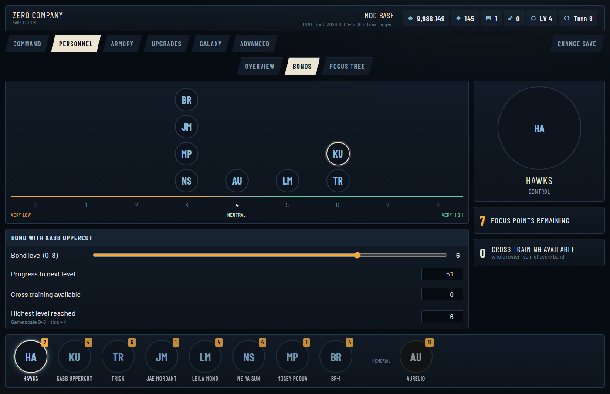
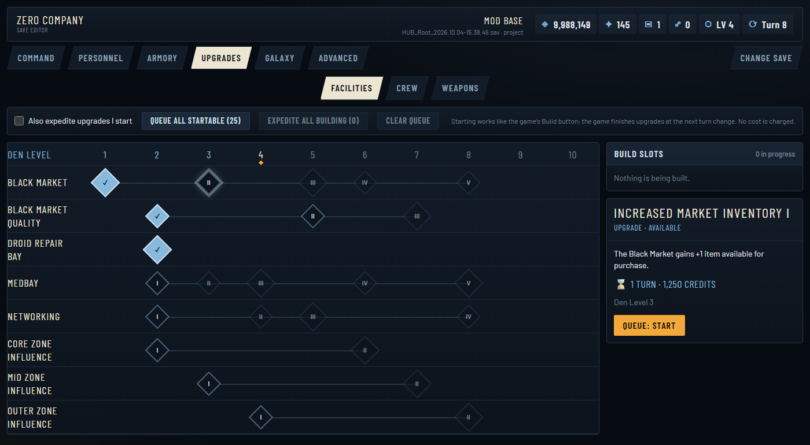
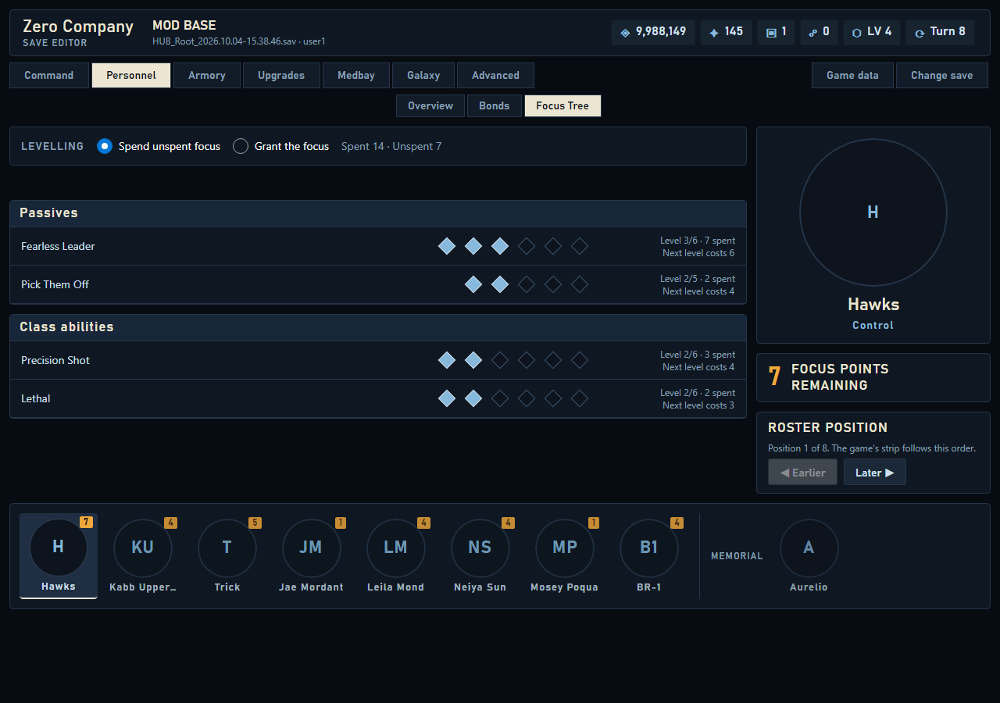

# Zero Company Save Editor

[](https://github.com/starmast/zero-company-save-editor/actions/workflows/tests.yml)
[](LICENSE)

A local web app for viewing and editing **Star Wars: Zero Company** save files, laid out the way the game presents
things (Command, Personnel, Armory, Upgrades, Galaxy). Every write is backed up and verified first.

> **Unofficial fan project.** Not affiliated with or endorsed by Disney, Lucasfilm, Electronic Arts or Bit Reactor.
> No game content is included. Editing saves is at your own risk: **read [DISCLAIMER.md](DISCLAIMER.md)** before use,
> and keep your own backups. Intended for offline, single-player use.

<p align="center">
   Bonds: partners placed on the game's 0-8 bond scale with an editor for the selected bond" width="900">
</p>

<details>
<summary>More screenshots</summary>

**Upgrades** - Den Level timeline, build slots and a detail panel


**Focus Tree** - set ability levels using the game's own focus costs
 Focus Tree: ability level pips with spent and next-level focus costs" width="900">

<sub>Screenshots use the `?portraits=off` option, so operators appear as initials; no game artwork is shown.</sub>
</details>

**Status:** early release (v0.1.0, see [CHANGELOG](CHANGELOG.md)). Tested with saves from game build
`++ProjectBruno+Stable` changelist 197649; a game update can change the save format.

## Features
- **Command** - save info, campaign progress (turn, level/XP), stockpile, and backups with one-click restore.
- **Personnel** - roster strip with the real operator portraits stored in your save; Overview (focus points, training and
  stat effects), Bonds (the game's 0-8 scale and roster-wide cross training) and Focus Tree (set ability levels; focus
  spent follows the game's own cost table, and you choose to spend your unspent focus or have it granted).
- **Upgrades** - Facilities / Crew / Weapons rows on the Den Level timeline with Build Slots. Start upgrades the way the
  game's Build button does and optionally expedite them so the game finishes them at the next turn change.
- **Armory** - utility items and weapon mods. **Galaxy** - influence, contacts and reward tier per region.
- **Advanced** - every editable value as a flat list, plus a raw property-tree viewer.
- Edits stay *pending* (with a readable list of what will change) until you press **Apply**.

## Requirements
- Windows 10/11 (the save location and the "is the game running?" check are Windows-specific)
- Python 3.10 to 3.14 (the test suite runs on all five versions in CI; developed on 3.14)
- A modern browser with internet access on first load (the page pulls Tailwind CSS and fonts from public CDNs)

## Quick start
Double-click **`run.bat`**. It creates a virtual environment, installs `requirements.txt`, starts the server and opens
your browser. Or, manually:

```
python -m venv .venv
.venv\Scripts\python -m pip install -r requirements.txt
.venv\Scripts\python app.py
```

Options: `--dir <folder>` to add another folder of `.sav` files, `--port N`, `--no-browser`.
The app lists `%LOCALAPPDATA%\SWZeroCompany\Saved\SaveGames` and a `saves/` folder next to the app.

**Recommended workflow:** close the game, copy a save into `saves/`, open the copy, make your edits, load it in the game,
and only then edit your real save.

## Safety
- The first time a save is opened, an untouched copy is stored in `backups/<folder>/<save>/` as `*.orig.sav`.
- Every write first snapshots the current file (the last 20 are kept). Restore any of them from **Command**.
- Writes go to a temp file, are verified (the file re-opens cleanly, only the intended values differ, sizes and metadata
  are consistent, edited values read back correctly), and only then replace the save atomically.
- The app refuses to write while the game appears to be running, or if the file changed since you opened it.
- "Save as copy" writes `<name>.edited-HHMMSS.sav` and leaves the original untouched.
- The server only listens on `127.0.0.1` and rejects requests with a foreign `Host`/`Origin` header.

## How it works
A save is a ZIP containing an Unreal Engine 5 `GVAS` file whose data sits in nested byte blobs. `zc/gvas.py` indexes
the property tree with byte offsets and edits fixed-size numbers in place, so everything it does not understand is
preserved byte-for-byte. The one structural edit is starting an upgrade (a few strings change length); there every
enclosing size field and the size recorded in the save's metadata are fixed up, and the write is refused unless a full
re-parse shows nothing else changed. Adding or removing characters, recipes or items is not supported.

Upgrade behaviour was checked against saves written by the game itself: starting an upgrade reproduces the game's own
recipe entry byte-for-byte, and the game then completes it (applying its real effects) on the next turn change.

## Optional: game data
Out of the box the editor works from the save alone. For game-accurate names, descriptions, upgrade costs/durations,
Den Level requirements and prerequisites, you can extract data **from your own game installation** with the .NET tool in
[`tools/extract`](tools/extract/README.md). The output goes to a git-ignored `gamedata/` folder and must stay on your
machine. See [DISCLAIMER.md](DISCLAIMER.md).

## Development
```
.venv\Scripts\python -m pip install -r requirements-dev.txt
.venv\Scripts\python -m pytest -q
```
Tests that need a real save or extracted game data skip themselves when those are absent (they are never committed),
so a fresh clone runs the synthetic tests only. To run everything, put a save in `saves/` (tests only ever write to
temporary copies, never to your game folder).

```
app.py             Flask app and routes
zc/gvas.py         offset-preserving GVAS reader/patcher
zc/savefile.py     ZIP container handling
zc/service.py      open/apply/restore workflow, backups, verification
zc/domain.py       editable fields (resources, operators, bonds, ...) built from the property tree
zc/views.py        screen-shaped view models for the UI
zc/upgrades.py     base-upgrade logic
zc/portraits.py    operator portraits (embedded OpenEXR -> PNG)
zc/gamedata.py     optional extracted game data
static/, templates/  the browser UI (vanilla ES modules, Tailwind via CDN)
tools/extract/     optional game-data extractor (C#)
tests/
```

## Feedback
Found a problem or have an idea? [Open an issue](https://github.com/starmast/zero-company-save-editor/issues/new/choose).
Please do **not** attach save files, game files or extracted game data to issues.

## Limitations
- Windows only. Built against the 2026 releases of the game; a game update can change the save format.
- No Medbay/injury editing, no adding items or abilities, no computed combat stats (health, damage); those need data this
  project has not yet been able to verify.

## Third-party software
Runtime: [Flask](https://flask.palletsprojects.com/) (BSD-3), [OpenEXR](https://pypi.org/project/OpenEXR/) (BSD-3),
[NumPy](https://numpy.org/) (BSD-3), [Pillow](https://python-pillow.org/) (MIT-CMU). Front end: Tailwind CSS (MIT) and
the Barlow font family (SIL OFL) loaded from CDNs. Tests: pytest (MIT).
Extractor (optional, not bundled): [CUE4Parse](https://github.com/FabianFG/CUE4Parse) (Apache-2.0), which downloads Oodle
(proprietary, Epic Games Tools / RAD) at run time, and a community-made `.usmap` mappings file you obtain yourself.

## Acknowledgements
The earlier [Zero_Company_Save_Editor](https://github.com/jpatrickp512/Zero_Company_Save_Editor) by jpatrickp512 was a
useful reference for which save properties matter; no code was copied from it.

## License
Source code: [MIT](LICENSE). The license covers this repository's code only; see [DISCLAIMER.md](DISCLAIMER.md) for
everything else.
