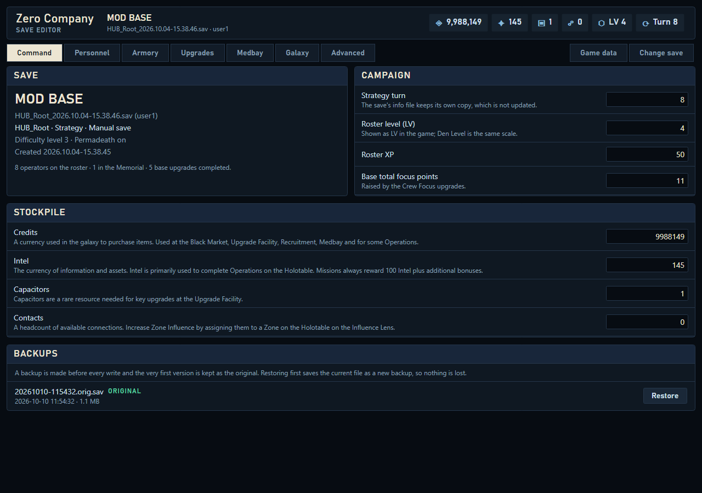

# User guide

How each screen works. Everything you change stays **pending** (shown in the bar at the bottom, with a list of what will
change) until you press **Apply to save**. **Discard** drops it all; **Save as copy** writes a separate file and leaves your
save alone.

## Opening a save
The **Saves** page lists the folders the editor knows about, each save with its in-game screenshot, name and turn. Use
**Add folder...** to point it at any other folder of `.sav` files. Settings and databank files can't be edited and are
listed as such.

The bar at the top shows your credits, intel, other resources, level and turn. Click any of them to type a new value.

## Command
Save details, campaign values (strategy turn, roster level and XP, base focus points), the stockpile, and your **backups**.
Press **Restore** on a backup to put it back; the current file is saved as a new backup first, so nothing is lost.

## Personnel
Pick an operator from the strip at the bottom. Hold and drag an operator's icon sideways (or use **Earlier / Later**) to change
the roster order; the game's own strip and mission select follow it.

- **Overview** - unspent focus points (the total moves with it so points spent stay the same) and training and stat effects.
- **Bonds** - partners placed on the game's 0-8 scale. Click a face to change that bond's level, progress or cross training.
- **Focus Tree** - set ability levels using the game's own focus costs. Choose **Spend unspent focus** (levelling costs
  what you have) or **Grant the focus** (levelling is free; the total rises to match).
- **Complete tree** - shown when an operator (such as the tutorial operator) is missing the higher tiers of some abilities.
  It copies them from another operator who has the same abilities.
- **Memorial** - a fallen operator's page has **Bring back**, which returns them to the roster ([limits](limitations.md)).

## Upgrades
Facilities, Crew and Weapons rows on a Den Level 1-10 timeline. Click an upgrade to see its cost, duration and requirements,
then **Queue: start**. Starting works like the game's Build button; the game finishes the upgrade at the next turn change.
Tick **Also expedite upgrades I start** to have it finish at the very next one. No cost is charged. **Queue all startable**
queues everything that can be started.

## Armory
Utility items and weapon mods, with how many you own. Use the search box to find one.

## Galaxy
Influence, contacts and reward tier for each region. Below, the **Coil upgrades** the enemy has gained from failed Crisis
missions: **Remove** puts the crisis back to available (it can be failed again), **Prevent** marks it as won. Both work on one
upgrade or all at once.

## Medbay
Beds, the bacta tank, their costs, who is injured and who is in treatment. **Heal** removes an operator's injuries the way the
bacta tank does, for free and instantly.

## Advanced
Every editable value as a flat list, grouped the way the save stores it, with a filter, plus a raw property tree that lets you
edit numbers in place. Use with care.

## Game data
Real names, descriptions and costs; see [game-data.md](game-data.md).
